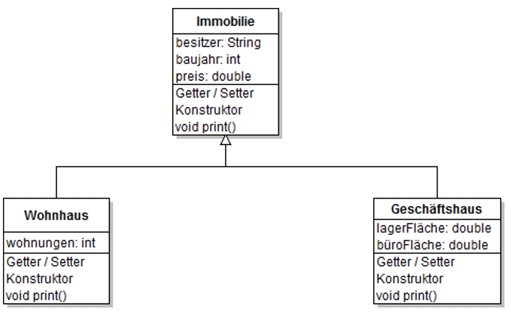
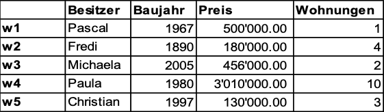
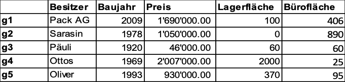
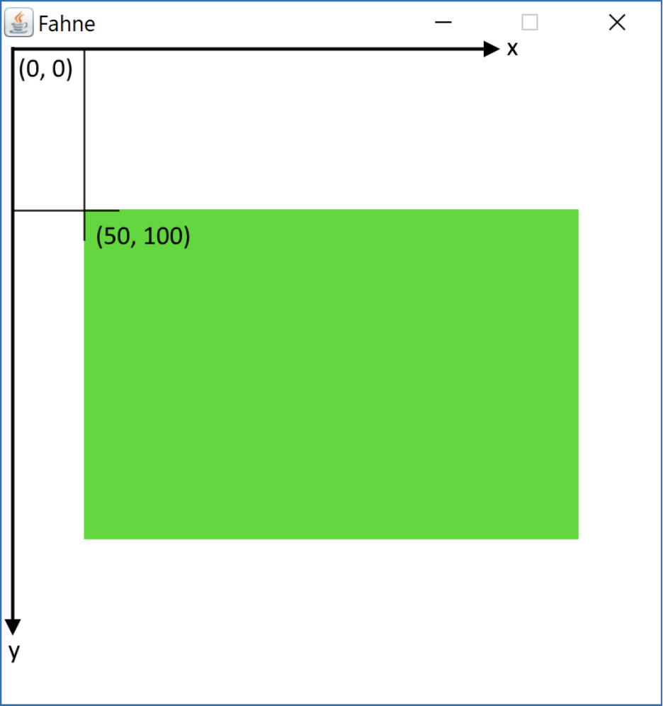
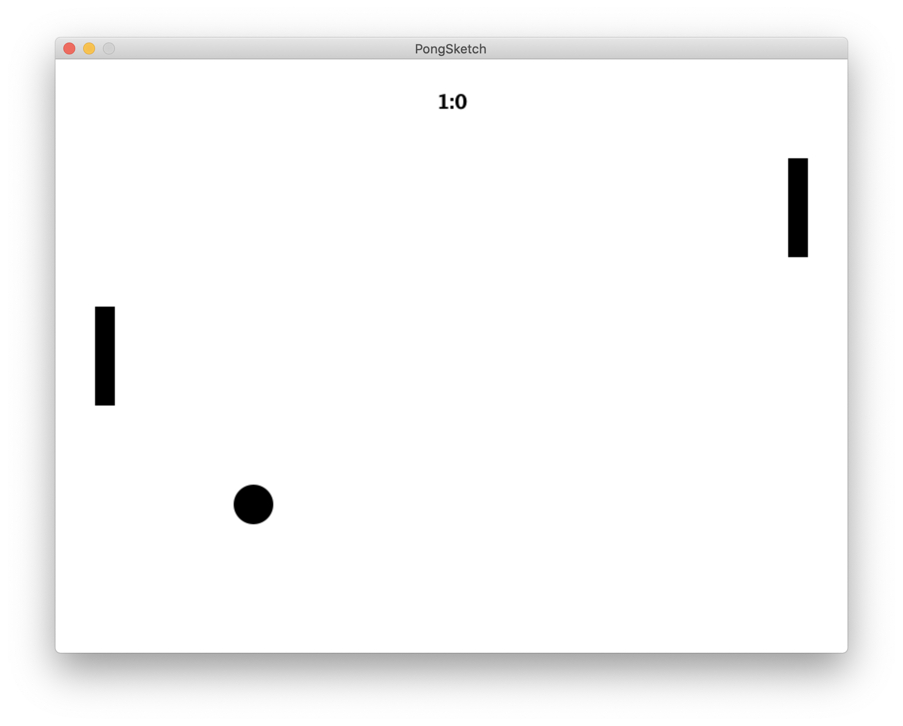
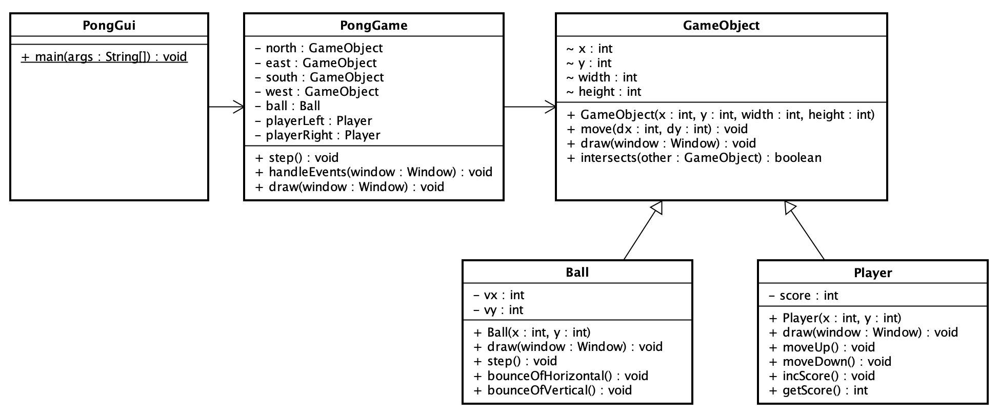

# Lerneinheit 04

Im Package [ch.fhnw.oop1.le](./src/ch/fhnw/oop1/le) finden Sie Code Beispiele aus den Videos.

# Arbeitsblatt (AB)

## Vererbung

### Ausgangspunkt:
Im Unterricht haben wir gesehen wie man mit Vererbung in Java arbeitet. Wir wollen nun einen konkreten Anwendungsfall umsetzen. Ihre Aufgabe ist es, das Portfolio einer Immobilienfirma in einer Objekthierarchie darzustellen.

Das folgende UML-Diagramm gibt Ihnen einen Überblick über die einzelnen Klassen.



Als erstes brauchen wir eine Klasse Immobilie, welche die Grundeigenschaften einer Immobilie
abbildet.

Wir gehen dazu wie folgt vor:

<ol type="a">
  <li>Erstellen der Oberklasse Immobilie</li>
  <li>Erstellen der Klasse Wohnhaus</li>
  <li>Erben von der Oberklasse Immobilie</li>
  <li>Erstellen der Klasse Geschäftshaus</li>
  <li>Verwenden der Klassen</li>
</ol>


### a) Erstellen der Klasse Immobilie

1. Schreiben Sie eine Klasse Immobile, welche die drei Variablen besitzer, baujahr und preis (private) enthält. Schreiben Sie auch die zugehörigen Getter- und Setter-Methoden, sowie einen Konstruktor, welcher die Startwerte der drei Variablen setzt.

2. Nun müssen wir noch überlegen, wie die Immobilie auf dem Bildschirm ausgegeben wird. Schrei-ben Sie dazu eine Methode `print`, welche die Informationen so ausgibt, dass es ungefähr aussieht wie:
Die Immobilie von Hans aus dem Jahr 1970 ist 605000 Franken wert.

3. Damit wir unsere Klassen jeweils auch testen können schreiben wir jetzt die Klasse, welche die main-Methode enthält. Die Klasse soll `Firma` heissen. In der `main`-Methode soll dann gleich das erste Objekt der Klasse `Immobilie` erstellt und die Informationen ausgegeben werden.
    ```java
    Immobilie i1= new Immobilie("Hans",1970,605000);
    i1.print();
    ```


### b) Erstellen der Klasse Wohnhaus

4. Nun soll die Klasse erstellt werden, welche dann später die Wohnhäuser abspeichert. Diese Klasse soll eine zusätzliche Variable enthalten, welche die Anzahl der verfügbaren Wohnungen speichert. Schreiben Sie also eine Klasse Wohnhaus, welche eine Variable wohnungen vom Typ int enthält und auch gleich noch Getter und Setter für dieses Feld.

    Bemerkung: Die Getter- und Setter können einfach mit VSCode generiert werden, auch die Konstruktoren. Öffnen Sie das Kontext-Menü innerhalb der Klasse (Rechtsklick im Editor) und wählen Sie
Source Action... -> Generate Getters and Setters...
Source Action...-> Generate Constructor...

### c) Erben von der Oberklasse Immobilie

5.	Diese Klasse erbt nun noch nicht von der Oberklasse Immobilie. Schreiben Sie nun nach dem Klassennamen die Erweiterung `extends Immobilie`.
    ```java
    public class Wohnhaus extends Immobilie {
      ...
    ```

6.	Dies führt nun dazu, dass vom Compiler ein Fehler angezeigt wird. Das liegt daran, dass die Klasse Wohnhaus noch keinen Konstruktor hat. Wir müssen deshalb den Konstruktor erstellen.
Schreiben Sie einen Konstruktor, der für alle Variablen der Klasse einen Parameter erhält.

    ```java
    public Wohnhaus(String b, int jahr, int wert, int w){
        super(b,jahr,wert);
      wohnungen= w;
    }
    ```

    Bemerkung: Auch hier kann Sie VSCode unterstützen mit dem Befehl Source -> Generate Constructor from Superclass

7)	Nun erfassen wir in der Klasse Firma ein neues Wohnhaus w1. Dies geschieht analog zum Erstellen des `Immobilien`-Objekts i1. Rufen Sie auch hier noch die Methode print auf. Schreiben Sie hier auf, was die neue Ausgabe ist.

8)	Nun soll für die Klasse Wohnhaus eine eigene print-Methode geschrieben werden, welche auf die Klasse zugeschnitten ist. Schreiben Sie eine print-Methode in der Klasse Wohnhaus, welche eine Ausgabe in der folgenden Art ausgibt:
Die Immobilie von Hans aus dem Jahr 1970 ist 605000 Franken wert.
Sie ist ein Wohnhaus und enthält 6 Wohnungen.
[Hinweis: Sie können nicht direkt auf die Variablen baujahr etc. zugreifen. Verwenden Sie dazu die
Getter-Methoden]

    Wie sieht die Methode `void print()` in der Klasse `Wohnhaus` aus?

    Kompilieren Sie ihr Programm, und starten Sie es erneut. Wie sieht nun die Ausgabe aus?

### d) Erstellen der Klasse Geschäftshaus

9. Nun haben wir einen Immobilientypen erstellt, und werden analog die Klasse Geschäftshaus erstellen und verwenden. Erzeugen Sie eine neue Datei namens Geschaeftshaus, welche die Klasse Immobilie erweitert (extends).

10.	Schreiben (bzw. ergänzen) Sie den Konstruktor.

11.	Fügen Sie die Attribute lagerFlaeche und bueroFlaeche hinzu und erstellen (bzw. generieren) Sie die Getter und Setter. Initialisieren Sie diese Variablen im Konstruktor.

12.	Schreiben Sie eine `print`-Methode, welche sich speziell auf die Klasse Geschaeftshaus bezieht. Bsp:
Die Immobilie von Hans aus dem Jahr 1970 ist 605000 Franken wert.
Sie ist ein Geschäftshaus mit 100m^2 Lagerfläche und 406m^2 Bürofläche.

13.	Verwenden Sie die Klasse, indem Sie ein Objekt des Typs Geschaeftshaus erzeugen. Nennen wir das Geschaeftshaus g1.

### e) Verwenden der Klassen
14.	So, nun haben wir alles, was wir für die Verwaltung von Wohn- und Geschäftshäusern brauchen. Nun wollen wir in unserer Firma einmal ein paar Häuser erfassen. Die folgenden Wohnhäuser haben wir aktuell im Angebot.

14)	So, nun haben wir alles, was wir für die Verwaltung von Wohn- und Geschäftshäusern brauchen. Nun wollen wir in unserer Firma einmal ein paar Häuser erfassen. Die folgenden Wohnhäuser haben wir aktuell im Angebot.


 
```java
Wohnhaus w1 = new Wohnhaus("Pascal", 1967, 500000, 1);
Wohnhaus w2 = new Wohnhaus("Fredi", 1890, 180000, 4);
Wohnhaus w3 = new Wohnhaus("Michaela", 2005, 456000, 2);
Wohnhaus w4 = new Wohnhaus("Paula", 1980, 3010000, 10);
Wohnhaus w5 = new Wohnhaus("Christian", 1997, 130000, 3);
```

  Und die folgenden Geschäftshäuser wurden erfasst


 
```java
Geschaeftshaus g1 = new Geschaeftshaus("Pack AG", 2009, 1690000, 100, 406);
Geschaeftshaus g2 = new Geschaeftshaus("Sarasin", 1978, 1050000, 0, 890);
Geschaeftshaus g3 = new Geschaeftshaus("Päuli", 1920, 46000, 60, 60);
Geschaeftshaus g4 = new Geschaeftshaus("Ottos", 1969, 2007000, 2000, 25);
Geschaeftshaus g5 = new Geschaeftshaus("Oliver", 1993, 930000, 370, 95);
```

Löschen Sie die aktuellen Gebäude, und erfassen Sie die Wohn- und Geschäftshäuser aus den obigen Tabellen. Sie können obige Code-Fragmente direkt kopieren.

15.	Geben Sie anschliessend alle Informationen zu den Häusern mit der jeweiligen `print`-Methode aus. Die Namen der einzelnen Immobilien suggerieren schon fast, dass diese Objekte nun in einem Array gespeichert werden sollen.

16.	Deklarieren Sie zwei Arrays, welche die Referenzen zu den Häusern speichern sollen. Schreiben Sie diesen Code nach dem Erstellen der Objekte, bevor sie ausgegeben werden.
    ```java
    Wohnhaus[] w = new Wohnhaus[]{w1, w2, w3, w4, w5};
    ```

17.	Nun soll die Ausgabe der Informationen in einer Schleife realisiert werden. Schreiben sie zwei Schleifen, welche die Informationen zu den gespeicherten Objekten ausgeben.
    ```java
    for (int i=0; i < w.length; i++) {
        w[i].print();
    }
    ```

    Bis jetzt hat es uns noch nicht viel gebracht, dass wir von einer Oberklasse Immobilie geerbt haben, von der wir gar keine Objekte erzeugen wollen, da alle unsere Immobilien entweder Wohn- oder Geschäftshäuser sind. Das soll sich nun ändern.
 
18.	Deklarieren Sie ein Array, welches aus Referenzen zum Typ Immobilie besteht ganz am Ende der `main`-Methode.
    ```java
    Immobilie[] immobilien = new Immobilie[10];
    ```

19.	Speichern Sie nun Referenzen zu diesen Objekten in diesem neuen Array:
    ```java
    immobilien[0]=w1;
    immobilien[1]=w2;
    ...
    immobilien[5]=g1;
    immobilien[6]=g2;
    ...
    ```

20)	Nun schreiben Sie anschliessend eine Schleife (analog zu Schritt 17)), welche für alle Objekte
im Array immobilien die Methode `print` aufruft. Es wird dabei immer die richtige Methode aufgerufen. 

    Wir werden diesen Aspekt in der nächsten Einheit noch weiter vertiefen!


&nbsp;

# Übung (UB)

## Pong
In dieser Aufgabe geht es darum, den Klassiker Pong von 1972 nach zu bauen.


 

### Graphische Benutzerschnittstelle mit der Window Klasse
Java enthält vordefinierte Klassen, mit denen man GUIs (graphical user interfaces) erstellen kann. Da diese Klassen allerdings äusserst komplex sind, verwenden Sie in diesem Kurs eine einfachere Klasse namens `Window`. Ein neues Window können Sie wie folgt erstellen:
```java 
Window window = new Window("Pong", 800, 600);
```
Das erste Argument (`"Pong"`) gibt den Titel des Fensters an und die beiden anderen Argumente (`800` und `600`) definieren die Fenstergrösse. Zusätzlich brauchen Sie ganz oben in der Java-Datei die Anweisung `import gui.Window;`.

Sie bestimmen den Inhalt des Fensters, indem Sie Zeichenbefehle auf dem `Window`-Objekt aufrufen. Diese bestehen meist aus zwei oder mehr Methodenaufrufen: Zuerst wird die Zeichenfarbe festgelegt und dann wird eine Form gezeichnet. Zum Beispiel:
```java
window.setColor(0, 220, 0);
window.fillRect(50, 100, 300, 200);
```
Der erste Aufruf setzt die Zeichenfarbe auf einen mittelhellen Grünton und der zweite zeichnet ein ausgefülltes Rechteck mit der linken oberen Ecke bei der Koordinate (50, 100), mit einer Breite von 300 Pixel und einer Höhe von 200 Pixel.

Die Farbe wird als RGB-Wert angegeben. Das erste Argument entspricht dem Rot-Kanal, das zweite dem Grün-Kanal und das dritte dem Blau-Kanal. Alle Werte sollten zwischen 0 und 255 sein.
```
(  0,   0,   0): schwarz
(255,   0,   0): rot 
(  0, 255,   0): grün 
(  0,   0, 255): blau
(255, 255,   0): gelb 
(255,   0, 255): magenta 
(  0, 255, 255): cyan
(127, 127, 127): grau 
(255, 255, 255): weiss
```
Das Koordinatensystem von GUIs ist ein wenig anders als das, welches Sie von der Mathematik her kennen. Statt von unten nach oben verläuft die y-Achse von oben nach unten und der Nullpunkt befindet sich in der linken oberen Ecke des Fensters:



Um das Fenster anzuzeigen, verwenden Sie als letztes die folgenden beiden Aufrufe:
```java
window.open(); 
window.waitUntilClosed();
```
Der erste Aufruf öffnet das Fenster und der zweite verhindert, dass das Programm sofort wieder beendet und das Fenster dadurch geschlossen wird. Erst wenn der Benutzer das Fenster schliesst, erreicht das Programm das Ende der `main`-Methode und wird beendet.

Eine gerade Linie kann wie folgt gezeichnet werden:

```java
window.drawLine(x1, y1, x2, y2);`
```
(x1, y1) entsprechen den Koordinaten des Startpunktes der Linie, (x2, y2) den des Endpunktes.

Wenn Sie wollen, können Sie vorher die Linienstärke mit folgendem Befehl bestimmen:
```java
window.setStrokeWidth(staerke);
```
Dieser Befehl beeinflusst auch andere draw-Methoden, wie `drawRect`, `drawOval` oder `drawCircle`. 
Ausgefüllte Figuren zeichnen Sie mit den Methoden `fillRect` und `fillOval` und `fillCircle`.

Das Programm [ch.fhnw.oop1.ub.WindowExample.java](./src/ch/fhnw/oop1/ub/WindowExample.java) illustriert beispielhaft die Verwendung der `Window`-Klasse. Studieren Sie es und führen Sie es aus.

###  Aufgabe 1

Um das Koordinatensystem zu verinnerlichen, erstellen Sie die Klasse `PongSketch`, die in der `main`-Methode folgende Grafik zeichnet.



Die Grafik muss nicht Pixelgenau der Vorgabe entsprechen, es geht darum, dass Sie mit der `Window`-Klasse experimentieren.

### Aufgabe 2

Jetzt sind Sie bereit das Spiel zu implementieren. Zwei Spieler sollen gegeneinander spielen können. 
Das Spiel besteht aus einem Ball und aus zwei Spielern, welche je einen vertikalen Balken kontrollieren und versuchen, den Ball im Spiel zu halten. Wenn der Ball das Spiel seitlich verlässt, erhält der gegenüberliegende Spieler einen Punkt. Wenn der Ball hingegen die Wände oben und unten oder einen Spielerbalken berührt, prallt er ab.

In Ihrem Projekt finden Sie bereits Vorlagen für folgende Klassen:

`PongGUI`: Verantwortlich für die Initialisierung der Window Instanz und den Game-Loop. Sie verwendet als Client-Code eine Instanz von `PongGame`.

`PongGame`: Verantwortlich für das Speichern und Berechnen der Spielsituation.

In der Klasse `PongGame` werden Sie Objekte für die Balken, den Ball und die vier Seitenwände verwalten. All diese Objekte sind `GameObject`s oder davon abgeleitete Klassen.

Das folgende Diagramm zeigt die Beziehungen zwischen den Klassen:



1. Erstellen Sie die Klasse `GameObject`. Die Klasse enthält die (`x`,`y`)-Koordinaten des Mittelpunktes des Objektes. Zudem hat ein `GameObject` eine Breite `width` und eine Höhe `height`.
Definieren Sie einen Konstruktor, der diese vier Werte als Parameter nimmt und in die Felder speichert. Implementieren Sie die Methode `void move(int dx, int dy)` um die Position anzupassen. Definieren Sie die Methode `void draw(Window window)`, aber lassen Sie den Body der Methode leer. Zudem definiert die Klasse die Methode `boolean intersects(GameObject other)`, die `true` zurückgibt, falls das übergebene `GameObject` sich mit diesem `GameObject` in der Ebene überschneiden. Diese Methode brauchen Sie später um Kollisionen zwischen den Objekten festzustellen. Verwenden Sie die folgende Implementierung:
    ```java
    public boolean intersects(GameObject other) {
      return x - width/2  < other.x + other.width/2
          && x + width/2  > other.x - other.width/2
          && y - height/2 < other.y + other.height/2           
          && y + height/2 > other.y - other.height/2;
    }
    ```

    Dann erstellen Sie die beiden Klassen `Player` und `Ball`, welche alle Informationen zu Spieler und Ball beinhalten. Beide Klassen sollen die Klasse `GameObject` erweitern. Ein Spieler speichert zusätzlich den Punktestand. Ein Ball hat zusätzlich eine (`vx`,`vy`)-Geschwindigkeit (in Pixel/Spielschritt). Diese zwei Felder können Sie gleich im Konstruktor mit Zufallswerten initialisieren:
    ```java
    double signX = Math.random() > 0.5 ? 1 : -1;
    double signY = Math.random() > 0.5 ? 1 : -1;

    this.vx = (int) (signX * (2 + (Math.random() * 4)));
    this.vy = (int) (signY * (2 + (Math.random() * 4)));
    ```

    Im Konstruktor der Klasse `PongGame` sollen zwei Player- und eine Ball-Instanz erstellt und in Attributen gespeichert werden. Der Ball soll zu Beginn des Spiels in der Mitte starten. Instanziieren Sie auch die vier Seitenwände direkt als Instanzen der Klasse `GameObject`. Diese werden benötigt, ob Kollisionen mit den Seitenwänden festzustellen. Bei den Seitenwänden können sie als Höhe bzw. Breite den Wert `0` verwenden.


2. Überschreiben Sie für die Klassen `Player` und `Ball` die geerbte Methode `void draw(Window window)`. Ein Ball soll sich als voller Kreis `fillCircle` zeichnen und ein Spieler als ausgefülltes Rechteck `fillRect`. Beachten Sie, dass unsere `GameObject` die (`x`,`y`)-Koordinaten im Zentrum des Rechtecks haben, die Methode `fillRect` sich aber auf die Ecke links oben bezieht.
Implementieren Sie nun auch die `drawGame(Window window)`-Methode der Klasse `PongGame`. Diese soll die `GameObject`s mittels deren `draw`-Methode zeichnen. Starten Sie das `PongGui` um zu sehen, ob die `GameObject`s korrekt dargestellt werden. Wenn Sie in der `draw`-Methode der Klasse `GameObject` mit roter Farbe `(255, 0, 0)` die Umrisse zeichnen, sehen Sie auch ob Sie die Seitenwände korrekt initialisiert haben.

3. Ergänzen Sie die `handleEvents`-Methode der Klasse `PongGame` so, dass man die Balken mittels Tastatur (z.B. mit `"up"`, `"down"` und `"w"`, `"s"`) bewegen kann. Die `Window`-Klasse bietet einige Methoden, um Input von Maus und Tastatur aufzunehmen. Eine davon ist `isKeyPressed(String keyName)`, welche `true` zurück gibt, wenn die spezifizierte Taste zum Zeitpunkt des Aufrufs gedrückt ist:
    ```java
    if (window.isKeyPressed("up")) { // move something around
    }
    ```
    Probieren Sie aus, wie viele Pixel pro Game Loop Iteration sich der Balken bewegen soll. Definieren Sie in der Klasse `Player` die Methoden `moveUp()` und `moveDown()`, die entsprechend an die geerbte Methode `move(int dx, int dy)` der Superklasse `GameObject` delegieren.

    In jeder Iteration wird die `step()`-Methode von `PongGame` aufgerufen. Ändern Sie `step()` so ab, dass sich der Ball entsprechend seiner Geschwindigkeit bewegt (noch ohne Kollisionen). Sie können die Logik gleich in einer neuen `step()`-Methode in der Klasse `Ball` festhalten.
    Starten Sie das Programm und überprüfen Sie, ob sich Spieler und Ball wie erwartet bewegen.

4. Fangen Sie jetzt in `PongGame.step()` die Kollisionen des Balls mit der oberen und unteren Wand ab. 
Wenn Sie eine Kollision zwischen Ball und Wand feststellen, soll der Ball abprallen. Es gilt "Einfallswinkel ist gleich Ausfallswinkel". Da alle Wände und Balken senkrecht oder waagrecht sind, ändert sich immer nur eine Komponente der Geschwindigkeit `vx` oder `vy` des Balls. Implementieren Sie die Funktionalität in den Methoden `Ball.bounceOfVertical()` und `Ball.bounceOfHorizontal()`.

5. Stellen Sie das Spiel fertig, indem Sie in `PongGame.step()` auch Kollisionen zwischen Ball und Spielerbalken abfangen.
Zählen Sie jetzt in `PongGame` auch die Punkte der Spieler. Wenn der Ball eine Seitenwand berührt (bzw. damit kollidiert), gibt es einen Punkt (`Player.incScore()`) und der Ball startet von neuem in der Mitte des Feldes. Zeichnen Sie auch den Punktestand ins `Window`.

Viel Spass beim Spielen!

### Credits
Diese Übung wurde von Michael Faes übernommen und angepasst. Vielen Dank!
